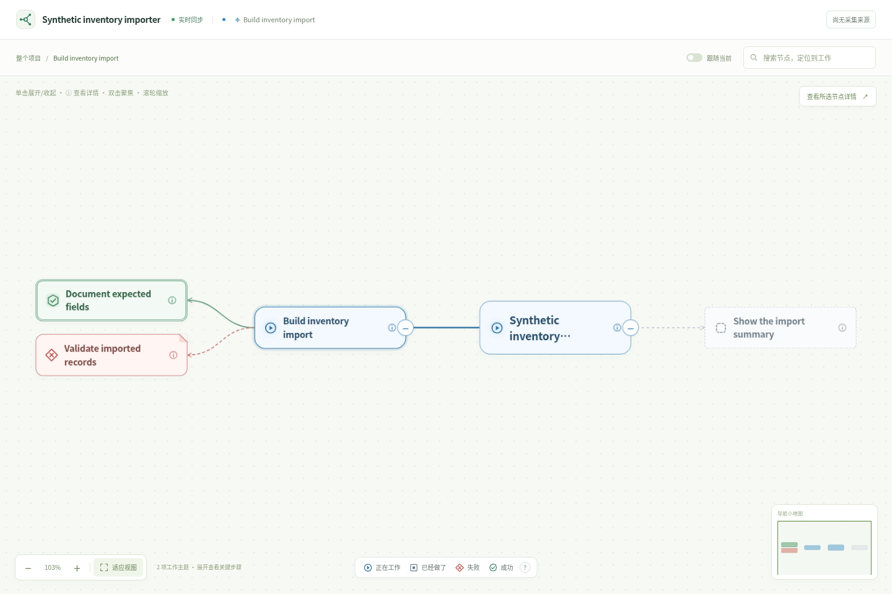

# Project Viz

A local Codex skill that turns a project's goals, meaningful work, and evidence into one persistent, zoomable work tree. It combines passive collection of associated public Codex activity with explicit work checkpoints. The project keeps its overall name while individual tasks progress.

The runtime uses **Python 3.10+ and the standard library**. The browser UI is bundled; users need no Node build, Docker, model API key, or hosted service.



The bundled interface currently uses Chinese labels; project and task names follow your own language. The preview contains synthetic data only.

Choose the interpreter name available on your platform: on Linux/macOS, use `python3` if `python` is absent; on Windows, use `python` or `py -3`. The examples below use `python` as shorthand for that selected Python 3.10+ interpreter. For example, the Linux installation command is `python3 tools/install_skill.py`.

## Install from this source checkout

```sh
python tools/install_skill.py
```

This copies the self-contained `skills/project-viz` folder to `~/.agents/skills/project-viz`. Select another host-supported skill location with an exact destination folder:

```sh
python tools/install_skill.py --destination /path/to/skills/project-viz
```

Existing destinations are refused unless `--replace` is supplied. Replacement retains a sibling backup, including any pre-existing files, and never changes project runtime state or global instructions. Installation may require refreshing your Codex skill list or opening a new session, depending on the host.

The GitHub repository is currently **private**: [Luozhengquan1995/project-viz](https://github.com/Luozhengquan1995/project-viz). With repository access and GitHub authentication configured, clone it and run the installer:

```sh
git clone https://github.com/Luozhengquan1995/project-viz.git
cd project-viz
python tools/install_skill.py
```

The installed `skills/project-viz` directory is self-contained; it has no runtime dependency on files outside that folder.

## Ask Codex to open a project

> Use $project-viz to organize this project's existing work and evidence, open its visual overview, and track further progress.

Codex identifies the project, initializes its overall title and goal, starts the local viewer, and returns the actual browser URL. It reads project documents and bounded normalized history to curate meaningful themes. Empty projects do not receive invented stages or placeholder research plans.

On a remote machine, the browser needs an authorized port-forwarding route. The service defaults to loopback; a local viewer is not a request to publish your files.

## Use the CLI directly

Run from the repository root, or replace the script path with its installed location:

```sh
python skills/project-viz/scripts/project_viz.py doctor --project /path/to/project
python skills/project-viz/scripts/project_viz.py init --project /path/to/project --title "My project" --goal "The overall objective"
python skills/project-viz/scripts/project_viz.py start --project /path/to/project --port 0
python skills/project-viz/scripts/project_viz.py context --project /path/to/project --limit 30
python skills/project-viz/scripts/project_viz.py status --project /path/to/project
python skills/project-viz/scripts/project_viz.py stop --project /path/to/project
```

`start` runs in the background by default; add `--foreground` for a terminal or supervisor, or `--open` to open the returned URL. Every command accepts optional `--state-dir` for the exact private project-state directory and `--codex-home` for source discovery. Use the same overrides on subsequent commands. Responses are JSON.

For reviewed history and ongoing semantic updates:

```sh
python skills/project-viz/scripts/project_viz.py import-history --project /path/to/project --seconds 15
python skills/project-viz/scripts/project_viz.py catalog --project /path/to/project --file catalog.json
python skills/project-viz/scripts/project_viz.py emit --project /path/to/project --file event.json
python skills/project-viz/scripts/project_viz.py export --project /path/to/project --output graph.json
```

`emit` also accepts JSON from stdin. Catalog imports atomically upsert records and retain omitted work. [The work protocol](skills/project-viz/references/work-protocol.md) defines field names, source binding, state semantics, and examples. [The synthetic project](examples/synthetic-project/README.md) provides a runnable catalog fixture without private logs.

## What stays visible

The graph represents an overall project, its actual work themes, and optional stages or key subtasks. Tool calls, waiting, file operations, and detailed logs sit inside work details. Navigation, search, and following activity operate on the same project tree, preserving other branches and historical work.

A stable `work_id` identifies an objective across title changes and sessions. `event_id` deduplicates retried reports. Execution and outcome are separate: `finished + failed` is a completed evaluation with a negative result; a successful command does not automatically mark its parent task successful. Later recovery does not require deleting prior failure evidence.

## Tracking and privacy boundaries

- Passive collection runs while the service is alive and associated source records are available. Import coverage and parsing gaps matter; a bounded pass does not promise complete historical recovery.
- Precise semantic organization is performed by the current Codex conversation, using project documents and public context. The collector makes no background model calls and cannot reliably infer every historical objective.
- Installing the skill does not force all future conversations to load it. v0.1 does not implement Hooks or automatic checkpoint injection. Explicit checkpoints improve continuity when the skill is being used.
- A project-level `AGENTS.md` reporting block is optional and added only when requested. Global instructions are not changed by the installer.
- Runtime state, access credentials, cursors, and logs are private per-project data. They are excluded from release builds. Curated exports exclude full raw logs, but summaries and evidence can still be sensitive; review them before sharing.
- The viewer observes work. It does not schedule experiments, resume Codex threads, or publish a project.

## Development and release bundles

```sh
python -m unittest discover -s tests -p 'test_*.py'
python tools/build_release.py --version 0.1.0 --output-dir dist
```

The browser regression uses optional Playwright and Chromium; it skips when those development dependencies are unavailable. The CI template defines a separate Linux browser job that installs them. They are not runtime dependencies.

The builder creates a self-contained skill ZIP and a source ZIP. It uses a source allowlist, rejects symlinked distributable files, omits private/log/database state, normalizes ZIP order, permissions, and timestamps, and includes a hash inventory in each archive. Identical inputs and Python/zlib toolchain produce byte-identical archives. Building a bundle does not upload or publish it.

The installation/update tool retains a backup when replacing an existing skill. To remove a manual installation, first stop any viewer launched from it, verify the exact skill directory, and remove that installation directory; keep project state if you want to reuse the history later. No automatic broad uninstall is provided.

Linux is the locally tested development platform. [The CI template](ci/github-actions-tests.yml) defines Python 3.10/3.12 jobs on Linux, macOS, and Windows. It is stored outside `.github/workflows` because the initial publishing credential lacks GitHub's `workflow` permission. CI is therefore not active in this repository. To enable it later, copy this file to `.github/workflows/tests.yml` and commit with a credential permitted to write workflows. Defining the jobs does not establish that they have run or passed; cross-platform support remains provisional until their results are available.

## License and attribution

MIT, copyright © 2026 Project Viz contributors. See [LICENSE](LICENSE) and [THIRD_PARTY_NOTICES.md](THIRD_PARTY_NOTICES.md). AGENTVIZ inspired parts of the agent-activity visualization; its replay application is not bundled.
